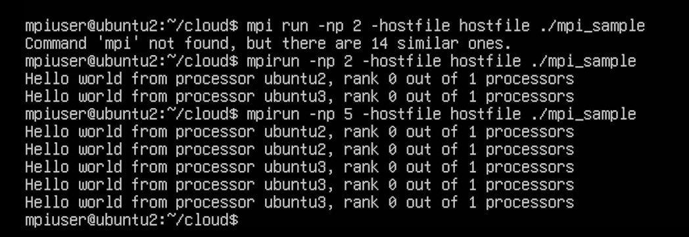

To set up and run MPI on two virtual machines (VMs) installed on your physical machine, you can follow these steps:

### Step 1: Install the VMs 
 
1. **Install VirtualBox or any other VM software** : Download and install VirtualBox (or another VM software) on your host machine.
 
2. **Create two VMs** : Set up two VMs with the same Linux distribution (e.g., Ubuntu).

### Step 2: Configure the Network 
 
1. **Network settings** : Set the network adapter of each VM to "Bridged Adapter" or "Host-only Adapter" to ensure they can communicate with each other.
 
2. **Assign static IP addresses** : Assign static IP addresses to each VM. You can do this in the network settings of your VM software or within the VMs themselves.

### Step 3: Install SSH on Both VMs 
 
1. **Install SSH server** :

```sh
sudo apt-get update
sudo apt-get install openssh-server
```
 
2. **Create a user**  (if not already created):

```sh
sudo adduser mpiuser
su - mpiuser
```
 
3. **Generate SSH keys** :

```sh
ssh-keygen -t rsa
```
 
4. **Copy SSH keys to the other VM** :

```sh
ssh-copy-id mpiuser@<IP_OF_OTHER_VM>
```

### Step 4: Setup Passwordless SSH 
 
1. **Start the SSH agent and add the key** :

```sh
eval `ssh-agent`
ssh-add ~/.ssh/id_rsa
```

### Step 5: Install NFS 

#### On VM1 (NFS Server) 
 
1. **Install NFS server** :

```sh
sudo apt-get install nfs-kernel-server
```
 
2. **Create a shared directory** :

```sh
mkdir /home/mpiuser/cloud
sudo chown mpiuser:mpiuser /home/mpiuser/cloud
```
 
3. **Configure NFS exports** :

```sh
sudo nano /etc/exports
/home/mpiuser/cloud <IP_OF_OTHER_VM>(rw,sync,no_root_squash,no_subtree_check)
```
 
4. **Export the directory** :

```sh
sudo exportfs -a
sudo service nfs-kernel-server restart
```

#### On VM2 (NFS Client) 
 
1. **Install NFS client** :

```sh
sudo apt-get install nfs-common
```
 
2. **Create a mount point** :

```sh
mkdir /home/mpiuser/cloud
sudo chown mpiuser:mpiuser /home/mpiuser/cloud
```
 
3. **Mount the shared directory** :

```sh
sudo mount -t nfs <IP_OF_VM1>:/home/mpiuser/cloud /home/mpiuser/cloud
```
 
4. **Make the mount permanent** :

```sh
sudo nano /etc/fstab
<IP_OF_VM1>:/home/mpiuser/cloud /home/mpiuser/cloud nfs defaults 0 0
```

### Step 6: Install MPICH on Both VMs 
 
1. **Install MPICH** :

```sh
sudo apt-get install mpich
```

### Step 7: Running MPI Programs 
 
1. **Create or copy your MPI program** :

```sh
cd /home/mpiuser/cloud
nano mpi_sample.c
```
 
2. **Compile the MPI program** :

```sh
mpicc -o mpi_sample mpi_sample.c
```
 
3. **Create a hostfile** :

```sh
nano hostfile
```
Content of `hostfile`:

```php
<IP_OF_VM1>
<IP_OF_VM2>
```
 
4. **Run the MPI program** :

```sh
mpirun -np 2 -hostfile hostfile ./mpi_sample
```

